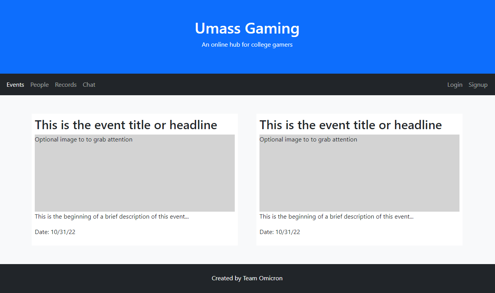

# Gaming at UMass - Team Omicron
 
## Semester Fall 2022
 
## Overview
 
This website we built takes aspects of popular websites that are used by many gamers alike, and bundles them all together, in a singular website.
Our website allows user to register/login, create events, comment on those events, message between users, and edit their profile, being to things such as, edit their bio, remove friends, and have a link to make events on the website. Our purpose with this whole operation was the ability to link gamers alike at UMASS. Our motivation strives from being avid gamers areself. We consistently found ourselves having a lack of friends on campus that played similar games as us. We felt that making a hub for people that felt similar on our view, would bring together a community that has yet to have an established footing on campus.
 
## Team Members
 
John Steenbruggen - Steenbruh
Connor Andrews - Swerdnacs
John Rand - johnrandd241
 
## User-interface
 
Events page - 

Login page - 

Register page - 
Profile page - 
 
 
## APIs
 
The API for our app consists of a few key components. The first being, the user logging in, they first send their credentials, server verifies them, and then gathers the rest of their data that is stored on the server. 
The next one being the event page, the user visits the page, and the server makes a request to the db, and gathers all the events, which are then displayed client side.
## Database
# _Users Table_

# _Post Table_

# _MessageLog Table_

Message Object:{

	“User”: string   //User who sent the message
	“Date”: date	    //Date and time of message being sent
	“Text”: string  //The body of the message
    
}

# _CommentLog Table_

Comment Object:{

	“User”: string   //User who made the comment
	“Date”: date	    //Date and time of comment posting
	“Text”: string  //The body of the comment
}
 
## URL Routes/Mappings
 
"/GetMsgFromUser" - gets a message from a message ID
'/CreateCommentSection' -  creates comments on events
"/GetMsgFromID" - get a message from an id 
"/posts" - gathers posts from the db
"/posts/create" - creates post, user must be signed in to accomplish this, as the call comes from the profile page 
"/users" - Returns a json displaying the users, was used for checking users and if fields were being properly updated
"/posts/get" - creates a more descriptive view of a post
"/users/get" - gets other users information once their name was clicked
"/users/addpost" - add post from the user signed in to the events db
"/users/changeprofile"
"/users/changebio" - updates the bio of the user signed in
"/events" - Directs users to the events page
"/login" - If user is logged out, it displays this button to redirect to the login page
"/logout" - User must be logged in to see this endpoint, it removes the users field from local storage and sends back a null user object, then redirects to events page
"/sendLoginCred" - unused
"/sendAllCred" - Sends back all of the user fields found from the db
"/login/auth" - Does a check based on what the user submitted on the login form, if user/pwrod are valid, returns the all the user fields and updates them clientside
"/register" - Redirects users to a page in which they can make a new profile
"/register/auth" - Takes in several variables from the user, checks to see if the email and username are in use via looking into the db, if they are not, a new row is made in the db.
"/profile" - User has to be signed in to view this page, all information on the user is stored client side in local storage, such as the bio, and friends list, and is displayed on this page.
'/user/addFriend' - must be signed in, this adds a user to the signed in users friends list via adding them into their friends list array in the db
'/user/removeFriend' - must be signed in, removes friend from friends array in db
'/content/addPost' - 
'/content/removePost'
'/content/search'
 
## Authentication/Authorization
 
Default permissions for someone who isnt logged in include not being able to access certain features including the messages and profile page. Upon logging in, users are granted access to their own profile page and are allowed to message other users as well as create events and add other users. They are authenticated on the login page by the username and password being sent to the server, which the server makes a SQL call to check if that user is in the database with those crediationals. It then returns a JSON object of all the user fields that are in the DB, being saved in localstorage on the client side, allowing for the js to easily update and pages.
 
## Division of labor
 
John Rand - Implemented the login/register pages. This includes checking if a user was already in the system, and also once a user is logged in, the logout button would then be displayed.  
John Steenbruggen - Implemented profile page, ability to search and view posts in events, people, and records, and added in post creation feature.
Connor Andrews - Setup and Implemented database including the design of tables and debugging of connection and SQL quereys. Was in charge of creating the messaging service.
 
## Conclusion
 
Working on this project, we gained a huge appreciation for websites developed in a similar manner. Our biggest hurdle in this assignment was figuring out how to use a variety of different methods and functions that we all had very little information on in order to achieve the desired outcome. We would've liked to know more on how to implement express servers, databases, and the linking of the two. If we had that knowledge going into this, we felt we would've been able to complete this project to a much higher standard. With that being said, we all learned so much about web programming from this project. The things we struggled with, we learned, and in the end were able to implement everything we wanted to from the project's conception.

 