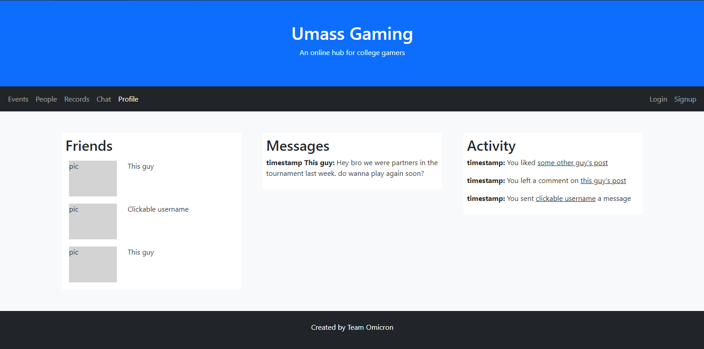

# Gaming at UMass - Team Omicron

## Team Overview

John Steenbruggen - Steenbruh
Connor Andrews - Swerdnacs
John Rand - johnrandd241

## Innovative Idea

This application is designed to bring together gamers in the UMass community. The site will essentially serve as a hub, where users can see upcoming events, meet new gaming partners, and discuss strategy.  It is a lot like most social media apps in the sense that users can create customized profiles, message each other directly, and post about their interests, but with a focus on organizing events and meetups for the UMass gaming community.

## Important Components/Data Interactions

The site is divided into four sections for events, people, records, and chat. In each section, users will be able to sort through posts using the seach bar and tag system, and after creating an account, users can interact with posts and create posts of their own. Key features of posts include title, date, location, description, and attendence, depending on the type of post. Users will also be able to friend and send direct messages to other users, to allow private information exchange.

## User Interface

Each page on our site (with the exception of the login/signup page) will have the title header and navigation bar at the top, as well as the team omicron footer at the bottom. The rest of the page content for the events, people, records, and discussion section look and function similarly to one another, with the key differences being the type and details of each post. The event page is shown below for example.

The profile page has a similar layout, except the columns now present the users friends, timestamped messages, and recent activity.

The login and signup page are combined into one (with a button to toggle between at the top). Users are provided with an option to sign up using a variety of services, including facebook and google, or by associating a password with their email or a username.

### Division of labor

Connor A. worked on the header and navigation bar, John S. focused on the page content for events and profile, and John R. created the login and signup pages.
